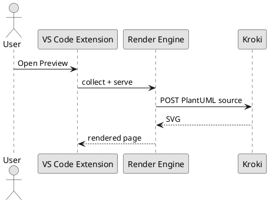
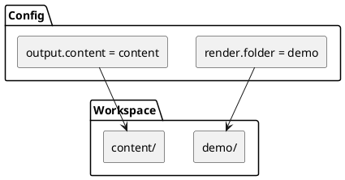

# PlantUML Demo

PlantUML remains a server-rendered diagram path through the configured
Kroki-compatible endpoint.

## Preview Flow

## Component View

## Notes

- `content/` can keep receiving fetched material.
- `demo/` can stay small and curated for smoke tests.
- Rendering chooses the docs root independently from fetch destination now.
