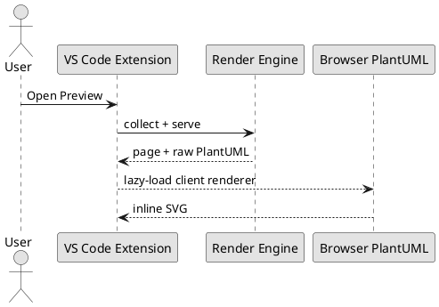
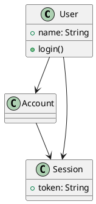
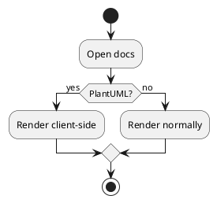
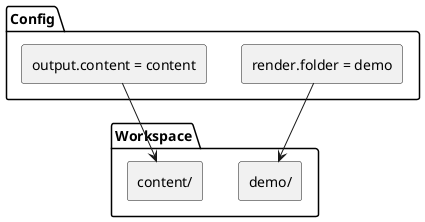
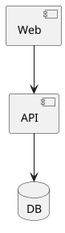
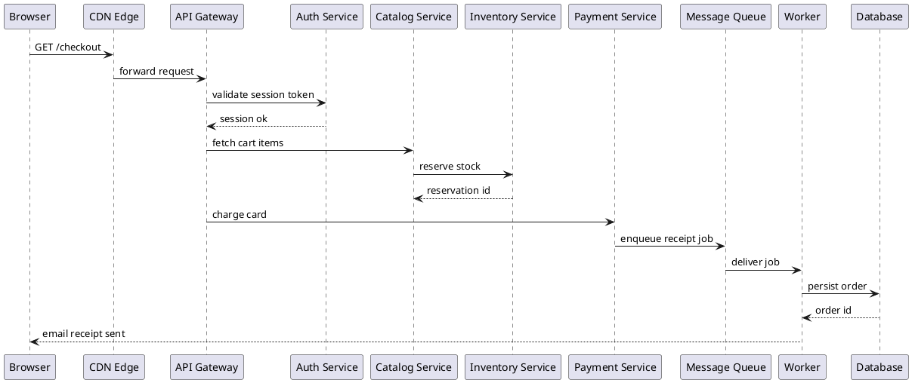
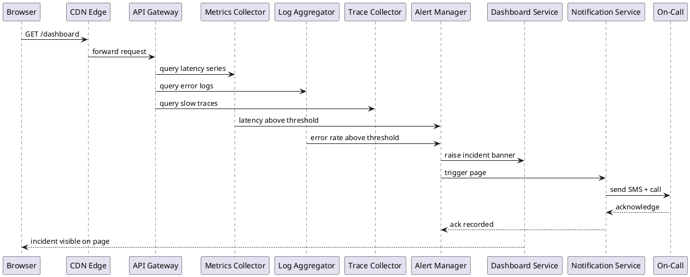

# PlantUML Demo

PlantUML renders in the browser through the official `@plantuml/core` engine.
This page intentionally contains six diagrams to exercise the serialized
render queue. It requires no Java, Docker, or external diagram server.

## Preview Flow

## Class View

## Activity View

## Component View

## Data View

## Wide Diagram Width Test

Intentionally much wider than the prose measure: the shell should grow with
the available content column and the diagram should shrink to fit it, never
rendering larger than its natural size.

## Linked PlantUML

The [linked PlantUML fixture](./linked-client-render.puml) uses the same client
renderer as fenced blocks.

## Notes

- `content/` can keep receiving fetched material.
- `demo/` can stay small and curated for smoke tests.
- Rendering chooses the docs root independently from fetch destination now.
- Client mode cannot automatically resolve arbitrary local `!include` files
  and omits some large optional sprite libraries. Configure
  `diagram.languages.plantuml: kroki` when affected content needs the server
  compatibility path.

## Wide Diagram Width Test

A second, distinct wide diagram placed at the very end of the page, to verify
that width-shrinking behavior also holds for the last diagram rendered on a
page (not just ones followed by more content):

