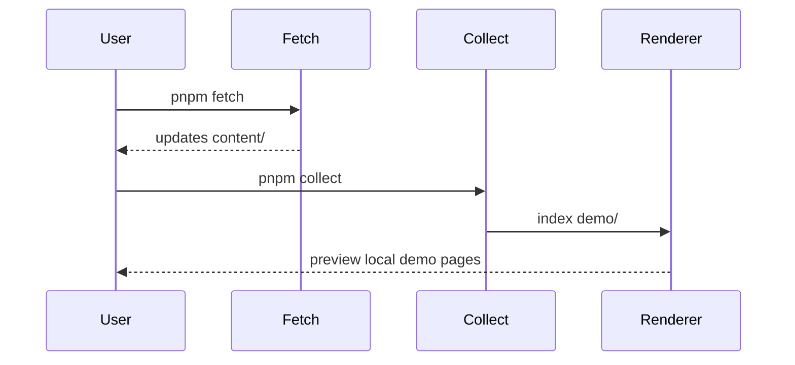

# Demo Home

This repository can now render a local top-level `demo/` tree even while
`fetch.github` keeps updating a separate `content/` folder.

Use these pages to smoke-test the main rich-content features:

- [Math formulas](./math)
- [PlantUML diagrams](./plantuml-demo)

## Why this folder exists

- Remote content fetches often need a stable destination such as `content/`.
- Local demos should still be renderable without rewriting fetched files.
- `manifest.yaml` can now point rendering at `render.folder: demo` while fetch
  continues to target `output.content: content`.

## Mermaid still works here too

## What to look for

| Page | Purpose |
|---|---|
| `demo/readme.md` | render-root split plus Mermaid smoke test |
| `demo/math.md` | inline and block math via KaTeX |
| `demo/plantuml.md` | server-rendered PlantUML through Kroki |
