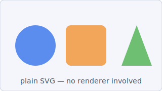

# SVG Demo

A plain SVG image embedded with standard markdown image syntax. No diagram
renderer (PlantUML, Mermaid) is involved — the browser displays the file as-is.

## Simple Shapes

The section heading above should show an image indicator in the outline menu.

## Text Only

This section has no image, so its outline entry should stay bare.
