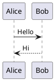
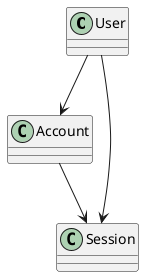
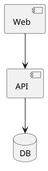
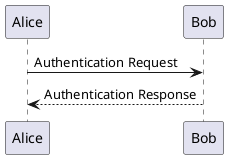
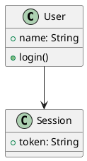
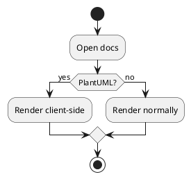
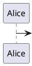

# Handoff: Client-Side PlantUML Rendering with `@plantuml/core`

## Goal

Move PlantUML rendering in `astro-huge-doc` from Kroki to the official client-side PlantUML engine, `@plantuml/core`.

The target outcome is:

- no Java requirement
- no PlantUML server requirement
- no Kroki requirement for PlantUML
- works in the VS Code desktop preview
- works in the normal Astro/browser preview
- renders real PlantUML, not a partial JavaScript reimplementation
- preserves the existing diagram/code toggle and pan/zoom UX
- preserves the existing light/dark PlantUML theme
- only loads the PlantUML engine on pages that contain PlantUML diagrams

Mermaid already follows the desired client-rendered direction. PlantUML should now follow the same architecture.

BlockDiag remains on Kroki.

---

## Why this is now possible

PlantUML officially publishes its TeaVM-compiled browser engine as:

```text
@plantuml/core
```

This is the real PlantUML implementation compiled from the upstream Java source to JavaScript.

It requires:

- `plantuml.js`, the TeaVM-compiled PlantUML engine
- `viz-global.js`, the Graphviz/Viz.js runtime used by diagrams that need graph layout

No installed Java runtime is required.

No PlantUML server is required.

The browser API exposes:

```js
render(lines, targetId, options)
renderToString(lines, onSuccess, onError, options)
```

For `astro-huge-doc`, prefer `renderToString()`.

The PlantUML browser engine has shared pending-render state. Concurrent renders in the same JS context can overwrite one another. All renders must therefore go through one serialized queue.

Do not render PlantUML blocks concurrently with `Promise.all()`.

---

## Target Architecture

Current:

```text
Mermaid   -> client Mermaid
PlantUML  -> Kroki
BlockDiag -> Kroki
```

Target:

```text
Mermaid   -> client Mermaid
PlantUML  -> client @plantuml/core
BlockDiag -> Kroki
```

Runtime flow:

```text
PlantUML block
    |
    v
plantuml-render.js
    |
    v
lazy load PlantUML engine
    |
    v
serialized render queue
    |
    v
injectPlantumlTheme(source, currentTheme)
    |
    v
renderToString(...)
    |
    v
SVG string
    |
    v
DiagramCode / Panzoom
```

The PlantUML runtime must not load on pages without PlantUML diagrams.

---

## Important Rendering Constraint

The upstream PlantUML browser renderer processes requests through shared internal state.

This is unsafe:

```js
await Promise.all(
  diagrams.map((diagram) => renderPlantuml(diagram))
);
```

Use one Promise chain:

```js
let renderQueue = Promise.resolve();

function enqueueRender(task) {
  const result = renderQueue.then(task, task);

  renderQueue = result.catch(() => {});

  return result;
}
```

Every PlantUML render must pass through this queue.

Using `renderToString()` avoids the need for a temporary DOM target and `MutationObserver`.

Wrap the callback API:

```js
function renderToSvg(engine, source, options) {
  const lines = source.split(/\r\n|\r|\n/);

  return new Promise((resolve, reject) => {
    engine.renderToString(
      lines,
      resolve,
      (error) => reject(new Error(String(error))),
      options
    );
  });
}
```

Verify the actual installed package signature before finalizing the wrapper.

---

## Phase 1: Add the PlantUML Browser Dependency

Add:

```text
@plantuml/core
```

Use the current stable package version resolved by `pnpm`.

Do not use:

- `node-plantuml`
- `plantuml-encoder`
- `@plantuml/mcp-js`
- CheerpJ
- `plantuml/plantuml.js`
- `puml-canvas-js`

`@plantuml/core` is the intended browser engine.

After installation, inspect the package layout.

Confirm the paths for:

```text
plantuml.js
viz-global.js
```

The engine module can be dynamically imported.

`viz-global.js` is a classic script that creates the global `Viz` API expected by the PlantUML TeaVM runtime.

Do not assume Vite can treat `viz-global.js` as a normal ES module.

---

## Phase 2: Load `viz-global.js`

Create a small loader responsible for loading the Graphviz runtime once.

Suggested location:

```text
src/components/markdown/code/plantuml-runtime.js
```

The loader should:

1. return immediately if `globalThis.Viz` already exists
2. reuse one module-level loading Promise
3. create a `<script>` element for `viz-global.js`
4. resolve only after the script has loaded
5. reject clearly on load failure

Conceptually:

```js
let vizPromise;

export function loadViz() {
  if (globalThis.Viz) {
    return Promise.resolve();
  }

  if (vizPromise) {
    return vizPromise;
  }

  vizPromise = new Promise((resolve, reject) => {
    const script = document.createElement('script');

    script.src = VIZ_URL;
    script.async = true;

    script.onload = () => resolve();
    script.onerror = () => reject(
      new Error('Failed to load PlantUML Graphviz runtime')
    );

    document.head.appendChild(script);
  });

  return vizPromise;
}
```

Prefer serving `viz-global.js` as a local Astro/Vite asset.

Do not load it from unpkg or jsDelivr at runtime.

The VS Code preview must remain fully self-contained and offline-capable.

---

## Phase 3: Create the PlantUML Client Renderer

Create:

```text
src/components/markdown/code/plantuml-render.js
```

Follow the guarded-init pattern already used by:

```text
mermaid-render.js
panzoom.js
```

Responsibilities:

- find PlantUML diagram shells
- lazy-load `viz-global.js`
- dynamically import the PlantUML engine
- serialize render requests
- inject the current PlantUML theme
- render SVG
- insert the SVG into the diagram container
- display rendering errors
- re-render on `mws:theme-change`

Suggested high-level state:

```js
let enginePromise;
let renderQueue = Promise.resolve();

function loadEngine() {
  enginePromise ??= Promise.all([
    loadViz(),
    import('@plantuml/core')
  ]).then(([, engine]) => engine);

  return enginePromise;
}
```

Do not load the engine until at least one PlantUML block exists.

Suggested initialization:

```js
const diagrams = document.querySelectorAll(
  '.diagram-shell[data-language="plantuml"][data-client-diagram]'
);

if (diagrams.length === 0) {
  return;
}

const engine = await loadEngine();

for (const diagram of diagrams) {
  await renderDiagram(engine, diagram);
}
```

Sequential iteration is intentional.

Do not replace it with `Promise.all()`.

---

## Phase 4: Route PlantUML to `client`

Change the renderer configuration.

In:

```text
manifest.yaml
```

change:

```yaml
diagram:
  languages:
    plantuml: kroki
```

to:

```yaml
diagram:
  languages:
    plantuml: client
```

Mirror the same default in:

```text
config.js
```

The no-manifest default and manifest default must remain identical.

Result:

```yaml
diagram:
  default_renderer: kroki
  languages:
    plantuml: client
    blockdiag: kroki
    mermaid: client
```

Do not change BlockDiag.

---

## Phase 5: Skip PlantUML in the Kroki Build Pipeline

`scripts/diagrams.js` already skips `client`-routed diagram languages for Mermaid.

PlantUML should inherit the same behavior after the renderer configuration changes.

Verify both storage paths:

```text
runJson()
runSqlite()
```

A client-routed PlantUML asset must not:

- build a diagram UID for rendered output
- POST to Kroki
- create a `code_diagram` SVG blob
- fail the collect/build because Kroki is unavailable

Linked `.puml` files must also inherit client rendering.

Verify this explicitly.

The current PlantUML implementation intentionally themes linked `.puml` files as well as fenced code blocks. Do not regress linked-file support.

---

## Phase 6: Reuse the Existing PlantUML Theme Injection

The repo already contains:

```text
src/libs/diagram-render.js
```

with:

```js
injectPlantumlTheme(code, theme)
buildPlantumlThemeHeader(colors)
PLANTUML_THEME_COLORS
```

Reuse this logic.

Do not create a second browser-specific PlantUML palette.

Rendering should approximately be:

```js
const theme = currentTheme();
const source = injectPlantumlTheme(rawSource, theme);

const svg = await enqueueRender(() =>
  renderToSvg(
    engine,
    source,
    { dark: theme === 'dark' }
  )
);
```

The existing custom `skinparam` theme remains the primary source of visual styling.

The upstream `{ dark: true }` option may still be passed so PlantUML's internal browser rendering mode matches the current site theme.

Do not depend exclusively on upstream dark mode until visual parity against the current dark/light implementation has been checked.

---

## Phase 7: Update `DiagramCode.astro`

`DiagramCode.astro` already distinguishes client-rendered Mermaid from Kroki-rendered diagrams.

Generalize this path so both:

```text
mermaid
plantuml
```

can be client diagrams.

Avoid Mermaid-specific assumptions in the shared client-diagram markup.

A client-rendered diagram should expose:

```text
data-language
raw diagram source
diagram output container
```

The raw source should be available to `plantuml-render.js` without fetching it from the server.

Prefer the same mechanism already used by Mermaid.

Possible shape:

```html
<div
  class="diagram-shell"
  data-language="plantuml"
  data-client-diagram
>
  <script type="text/plain" class="diagram-source">
    ...
  </script>

  <div class="diagram client-diagram-output"></div>
</div>
```

Reuse existing markup where practical.

Do not introduce a PlantUML-only HTML structure unless necessary.

---

## Phase 8: Preserve Pan/Zoom and Full View

The rendered PlantUML result is inline SVG.

This should use the same live-SVG pan/zoom strategy considered for Mermaid.

Do not render PlantUML through `<object>` after the client migration.

The previous PlantUML theme implementation needed explicit SVG backgrounds because Chrome gave `<object>`-embedded SVGs a white canvas.

That problem should disappear when the SVG is inserted inline.

Check:

```text
src/components/panzoom/
```

and the Mermaid inline SVG path.

PlantUML should get:

- normal responsive diagram display
- expand/full-view support
- pan
- zoom
- link handling where supported
- diagram/code toggle

Prefer one inline-SVG panzoom implementation shared with Mermaid.

Do not retain a special PlantUML `<object>` pipeline only for historical compatibility.

---

## Phase 9: Theme Change Re-render

PlantUML must listen to:

```text
mws:theme-change
```

Use the same event already used by Mermaid.

On theme change:

1. determine current theme
2. re-inject the PlantUML theme into the original raw source
3. queue a new PlantUML render
4. replace the existing SVG

Do not inject a new theme into already themed source.

Always preserve the original PlantUML source separately.

Correct:

```text
raw source
   |
   +-- dark render -> inject dark header
   |
   +-- light render -> inject light header
```

Incorrect:

```text
raw
 -> inject dark
 -> inject light into dark source
 -> inject dark into doubly themed source
```

Add a render generation/token guard if necessary so an older queued theme render cannot replace a newer requested theme.

Example:

```js
let generation = 0;

async function rerender(container) {
  const currentGeneration = ++generation;

  const svg = await queueRender(...);

  if (currentGeneration !== generation) {
    return;
  }

  container.innerHTML = svg;
}
```

If generation needs to be per diagram, store it in a `WeakMap`.

---

## Phase 10: Delete the Kroki-Specific Lazy-Light PlantUML Path

Once client PlantUML is verified, remove the server-side light SVG infrastructure added for Kroki PlantUML theming.

Candidate deletion:

```text
src/pages/diagrams/light-svg.js
```

Remove PlantUML-specific use of:

```text
data-theme-lazy
data-dark-url
data-version-id
```

from the panzoom path where those values only exist for PlantUML theme swapping.

Remove:

```text
lazy-light/
```

cache behavior and related runtime logic.

Remove PlantUML URL swapping from:

```text
src/components/panzoom/panzoom_common.js
```

Do not remove generic behavior needed by another feature.

The target theme architecture is:

```text
Mermaid:
theme event -> client re-render

PlantUML:
theme event -> client re-render
```

not:

```text
PlantUML:
theme event -> change object URL -> server endpoint -> Kroki -> disk cache
```

Keep `injectPlantumlTheme()` because it is still required by client rendering.

`renderKrokiDiagram()` remains required for BlockDiag and for any explicitly Kroki-routed language.

---

## Phase 11: VS Code Extension Configuration

The current VS Code setting:

```text
microwebstacks.preview.krokiServer
```

describes Kroki as rendering:

```text
PlantUML and BlockDiag
```

Update the description.

It should now make clear:

```text
Mermaid renders client-side.
PlantUML renders client-side.
Kroki is used for BlockDiag and other Kroki-routed diagram languages.
```

Do not remove `krokiServer`.

BlockDiag still needs it.

Also update the extension description/docs so PlantUML support no longer implies a local Docker or external Kroki requirement.

The VS Code preview's default experience should render Mermaid and PlantUML with zero external setup.

---

## Phase 12: CSP and WASM Verification

Graphviz-backed PlantUML diagrams use Viz.js WASM.

Test the actual Astro application inside the VS Code desktop preview.

The official PlantUML browser extension uses:

```text
wasm-unsafe-eval
```

in its CSP.

Do not add this blindly.

First test the current local Astro preview and VS Code iframe/webview behavior.

Test at minimum:

### No-Graphviz diagram



### Graphviz-backed class diagram



### Component diagram



If sequence diagrams work but class/component diagrams fail, investigate WASM/CSP first.

Verify:

- normal browser on localhost
- VS Code desktop preview
- Windows
- macOS
- Linux where practical

Any CSP change should be scoped as narrowly as possible.

---

## Phase 13: Caching

Do not add persistent cache infrastructure in the first implementation unless profiling proves it necessary.

The browser session can use a simple in-memory SVG cache:

```text
sha256(
  source +
  theme +
  plantuml engine version
)
```

or a normal `Map` keyed by a deterministic string if the source volume is modest.

Suggested cache:

```js
const svgCache = new Map();

function cacheKey(source, theme) {
  return `${theme}\0${source}`;
}
```

Because documentation navigation may preserve the Astro page runtime only briefly, session persistence is optional.

The first implementation should prioritize correctness.

Potential later optimization:

```text
sessionStorage
IndexedDB
service worker cache
```

These are non-goals for the initial migration.

---

## Phase 14: Failure Behavior and Kroki Fallback

For v1, client rendering errors should be visible in the diagram shell.

Show:

```text
PlantUML rendering failed
<error message>
```

The source/code toggle must remain usable.

Do not silently hide a failed diagram.

A future renderer mode may support:

```yaml
plantuml: auto
```

with:

```text
client render
    |
    +-- success -> SVG
    |
    +-- failure -> Kroki
```

Do not implement `auto` in the initial migration unless it is trivial.

Initial supported routing remains:

```yaml
plantuml: client
```

or explicitly:

```yaml
plantuml: kroki
```

This means users can still opt back into Kroki through the manifest if client compatibility with a specific diagram is insufficient.

Preserve that configurability.

---

## Compatibility Risks

### Local `!include`

Browser PlantUML cannot naturally read arbitrary workspace files.

Test existing `.puml` content for:

```text
!include
!include_once
!include_many
```

Local filesystem includes may require preprocessing in the Node collect layer before sending source to the browser.

Do not silently break local includes.

Possible later architecture:

```text
collect layer
   |
   v
resolve local PlantUML includes
   |
   v
expanded source
   |
   v
client renderer
```

Remote URL includes should be treated separately because of networking, security and offline-preview concerns.

For the first implementation, document current behavior and preserve `plantuml: kroki` as an escape hatch.

### Standard library and sprites

The npm package intentionally excludes very large optional sprite bundles.

Test any existing documentation using:

```text
AWS
IBM
Material
Tupadr3
OpenIconic
C4
```

The upstream browser engine has support for PlantUML standard-library loading infrastructure, but not all optional sprite payloads ship in the normal npm package.

Do not claim full sprite-library compatibility without testing.

### Engine size

The PlantUML package is much larger than existing client dependencies.

It must remain lazy-loaded.

Add a build checkpoint:

```text
pnpm build
```

Record:

- PlantUML engine asset size
- Viz asset size
- compressed size where available
- whether either asset enters pages without PlantUML diagrams

Pages without PlantUML must not execute or eagerly import the engine.

---

## Tests

Add client rendering coverage for:

### Basic sequence



### Class diagram



### Activity



### Linked `.puml` file

Verify a linked PlantUML file renders through the same client path.

### Multiple diagrams on one page

Use at least five PlantUML diagrams.

Confirm:

- all five render
- none disappear
- none receive another diagram's SVG
- ordering is stable

This is specifically a render-queue regression test.

### Theme switching

For every major test diagram:

```text
dark -> light -> dark
```

Confirm:

- SVG changes theme
- no duplicated `skinparam` header
- no stale light render replaces a later dark render
- pan/zoom still works after SVG replacement

### Error handling

Invalid PlantUML:



Confirm the shell shows an error and the source remains accessible.

### No Kroki

Start the VS Code preview with:

```text
no Docker
no Kroki server
no Java
```

Mermaid and PlantUML must render.

BlockDiag may fail or require Kroki as documented.

---

## Documentation Updates

Update:

```text
readme.md
packages/vscode-extension/readme.md
.env.example
manifest/config documentation
```

Remove statements saying PlantUML requires Kroki.

Document the new renderer split:

```text
Mermaid   client-side
PlantUML  client-side
BlockDiag Kroki
```

Document that users may explicitly configure:

```yaml
diagram:
  languages:
    plantuml: kroki
```

as a compatibility fallback.

Mention that local `!include` and optional sprite-library behavior may differ in client mode if those limitations remain after testing.

---

## Non-Goals

Do not:

- embed Java
- download Java
- bundle `plantuml.jar`
- launch a JVM from the VS Code extension
- adopt CheerpJ
- use the MCP server as the browser renderer
- replace PlantUML with a partial TypeScript implementation
- move BlockDiag away from Kroki
- implement PNG/PDF PlantUML export
- implement persistent browser caching
- implement `plantuml: auto` unless clearly trivial
- guarantee every optional PlantUML sprite library works

---

## Recommended Implementation Order

1. Install and inspect `@plantuml/core`.
2. Build a minimal browser spike using `viz-global.js` + `renderToString()`.
3. Verify sequence and class diagrams in normal Astro preview.
4. Verify the same spike inside the VS Code desktop preview.
5. Implement the single render queue.
6. Add `plantuml-render.js`.
7. Route PlantUML to `client`.
8. Reuse `injectPlantumlTheme()`.
9. Integrate inline SVG with DiagramCode and Panzoom.
10. Add theme-change re-rendering.
11. Verify multiple diagrams on one page.
12. Remove the Kroki lazy-light PlantUML path.
13. Update VS Code Kroki setting text.
14. Test linked `.puml` files and includes.
15. Measure bundle/assets.
16. Update documentation.

Do not delete the current Kroki PlantUML theme path before the minimal `@plantuml/core` spike has rendered both a sequence diagram and a Graphviz-backed class diagram inside the VS Code desktop preview.

---

## Exit Criteria

The implementation is complete when:

- PlantUML defaults to the `client` renderer.
- PlantUML renders without Java.
- PlantUML renders without Kroki.
- PlantUML renders inside the VS Code desktop preview.
- A Graphviz-backed class diagram renders successfully.
- Multiple PlantUML diagrams on one page render reliably through a serialized queue.
- Dark/light theme switching re-renders PlantUML correctly.
- PlantUML uses the existing custom theme palette.
- The diagram/code toggle still works.
- Pan/zoom and full view work with inline PlantUML SVG.
- Linked `.puml` files still render.
- Pages without PlantUML do not eagerly load the PlantUML runtime.
- BlockDiag remains on Kroki.
- Users can explicitly route PlantUML back to Kroki.
- The Kroki-specific lazy-light PlantUML endpoint and URL-swapping path are removed once no longer needed.
- VS Code and project documentation no longer say PlantUML requires Kroki.
