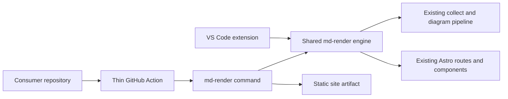

# Reusable render command and GitHub Action

## Status

Implemented and validated. Architecture decisions OP-001 through OP-009 are
accepted; all five implementation phases (static contract, shared command,
package/extension isolation, thin Action, validation and handoff) are done.
See `implementation.md` for the full record.

## Problem summary

Other repositories need to turn their own Markdown content into a deployable
website using this repository's renderer. The first expected consumer is
`vectormind.github.io`.

The published `@microwebstacks/md-render` package already contains the shared
collection, diagram, Astro SSR, and server runtime used by the VS Code
extension. It does not expose a supported command that produces a static
directory for GitHub Pages. The root Astro configuration is fixed to the Node
adapter and `output: "server"`, so the reference `withastro/action` workflow
cannot consume another repository's content without copying the application.

The assessment in this packet concludes that GitHub Pages should use a true
Astro static build, not an SSR crawler/export workaround. The current website
also has no intrinsic documentation-rendering requirement for SSR. Static can
become the common rendering model while server mode remains an explicit option
for the few runtime capabilities that actually need it.

## Goal

Expose one documented, versioned render command from
`@microwebstacks/md-render` that builds a consumer workspace into a static
deployment artifact, plus a thin GitHub Action that invokes it. Reuse the
engine's existing collection, diagram, routing, and page-rendering logic. Keep
the VS Code extension an independent consumer of the same engine; do not make
it aware of GitHub Actions or static deployment.

## Proposed architecture



The engine package is the product boundary. The Action owns only CI setup,
input validation, command invocation, and output exposure. It must not copy
renderer source, reproduce collection steps, import extension code, or encode
navigation/rendering policy.

Provisional command shape:

```text
md-render build --workspace <path> --out-dir <path> \
  [--manifest <path>] [--site <absolute-url>] [--base <path>]
```

Exact executable and option names may be refined during implementation without
changing the accepted boundary. Arguments are the public API; environment
variables remain an internal compatibility layer for the current configuration
loader.

## Static versus SSR assessment

### Finding

Today's documentation website can be generated statically without losing its
core functionality. Pages and navigation are functions of a collected,
versioned content snapshot. Markdown, highlighting, math, menus, citations,
cards, galleries, and client-rendered Mermaid and PlantUML do not require
request-time server execution.

The main engine change is structural, not a rendering rewrite: Astro must
receive the collected route set through `getStaticPaths()`, and the build must
copy content-addressed blobs into the static artifact. Existing page components
and the `structure-db` interface remain the rendering source of truth.

### Current SSR rationales

| Current behavior | Why SSR helps today | Needed for static docs? | Assessment |
| --- | --- | --- | --- |
| Dynamic `[...url]` route | Resolves collected URLs at request time without declaring build paths | No | Generate paths from `getDocuments()` |
| SQLite reads during rendering | Reads the latest collected version and avoids building every page | No, if content changes trigger a rebuild | Read the same backend at build time |
| Blob middleware/route | Adds MIME, ETag, and immutable-cache headers | No | Copy hashed blobs into `dist/blobs`; hosting owns headers |
| HTML cache middleware | Reduces repeated SSR work | No | Prebuilt HTML removes the need |
| Optional GitHub auth/sessions | Protects or personalizes a running server | Yes, if required | Keep as server-only; it is not document rendering |
| Runtime store replacement | Publishes newly collected data without rebuilding Astro | Yes, for hot publication | Static hosting intentionally rebuilds on content changes |
| Request pathname | Selects active navigation | No | `Astro.url.pathname` exists during each prerender |
| Custom Node server | Composes HTTPS, CORS, auth, blobs, assets, and SSR | Only for those server operations | Retain as an optional adapter, not the default renderer |

### Lite versus full assessment

Lite remains materially different, but primarily in resource and data choices,
not page architecture:

| Area | Full today | Lite today | Static implication |
| --- | --- | --- | --- |
| Content backend | SQLite by default, native `better-sqlite3`, historical versions | JSON by default, plain blobs, no native database | Both can prerender through the same `structure-db` API |
| Image pipeline | Sharp-backed Astro optimization | Passthrough image service | Choose independently from output mode |
| 3D/model viewer | GLB rendering enabled | GLB degrades to YAML highlighting or a plain link | Only identified user-visible profile difference; select explicitly |
| Dependencies | Includes full/native/heavy dependencies | Staged engine excludes them | Preserve profiles for footprint and extension reliability |
| HTML cache | Enabled for non-JSON | Disabled | Irrelevant for static output |
| Routes/components | Shared page/layout architecture | Same architecture with a few component gates | One static generation path should serve both |

The design should separate three concerns currently partially bundled together:

1. `output`: static or server;
2. `backend`: JSON or SQLite;
3. `feature profile`: full or lite.

Static must not mean lite, and JSON must not mean extension UI. The reusable
command and Action are explicitly `output=static`, `backend=json`, and
`profile=full`. Lite may later adopt static as its default after focused parity
and extension testing, but this packet does not change the extension: it remains
lite/json SSR for now.

## Ownership boundaries

| Surface | Owns | Must not own |
| --- | --- | --- |
| Shared engine | Collection, diagrams, routes, components, themes, assets, export orchestration | GitHub permissions, deployment, extension UI |
| Render command | Arguments, isolated configuration, lifecycle, artifact production | A second collection or rendering implementation |
| GitHub Action | Runtime setup, command invocation, output path | Rendering logic or Pages deployment policy |
| VS Code extension | Engine acquisition, preview lifecycle, webview integration | Static export or Action behavior |
| Consumer repository | Content, manifest, site/base, workflow, upload, deployment, version pin | Renderer source or internals |

## Scope

- Define the durable consumer workspace, manifest, command, output, error, and
  versioning contract.
- Add a public command entry point to the published engine package.
- Add the minimum build/export profile required for a self-contained static
  artifact from the existing dynamic routes and data layer.
- Reuse `config.js`, `scripts/collect.js`, `scripts/diagrams.js`, existing
  structure backends, Astro routes/components, and asset behavior through
  shared functions or their existing entry points.
- Add a repository-root `action.yml` as a thin composite Action.
- Prove Action and extension use the same staged engine without changing one
  another's configuration or packaging lifecycle.
- Add a minimal consumer fixture/workflow resembling the intended
  `vectormind.github.io` integration, without deploying it.
- Document immutable version pinning and consumer-side Pages upload/deployment.

## Non-goals

- Implement or deploy the `vectormind.github.io` workflow in this packet.
- Put GitHub Actions behavior inside the VS Code extension or call extension
  internals from the command.
- Copy components, collection code, or diagram code into consumer repos or the
  Action.
- Preserve authentication, sessions, or mutable APIs in static output.
- Fetch arbitrary content implicitly or scan consumer `.cache/` directories.
- Publish, tag, push, or deploy during implementation verification.

## Open points and design decisions

| ID | Decision | Proposal | Confidence | Status |
| --- | --- | --- | --- | --- |
| OP-001 | Static-generation strategy | Add a true Astro static configuration. Generate `[...url]` paths from collected documents with `getStaticPaths()`, render existing pages/components, and copy blobs as static assets. Do not add an SSR crawler/exporter unless implementation evidence requires a newly reviewed decision. | High | Accepted |
| OP-002 | Public command/package boundary | Add a `bin` command to existing `@microwebstacks/md-render`. Let the extension retain its script/server calls initially; do not force an extension migration. | High | Accepted |
| OP-003 | Action location | Keep `action.yml` here while it is only a wrapper. Split repositories only if branding, permissions, or release cadence diverge. | High | Accepted |
| OP-004 | Action and engine versions | Install an exact engine version, defaulted to the version tested with the Action release. Print both versions; consumers pin the Action by release tag or SHA. | High | Accepted |
| OP-005 | Static content backend | Use JSON for static builds, with no client/runtime SQLite database. Preserve the shared backend interface and improve JSON/SQLite render parity over time. | High | Accepted |
| OP-006 | Pages artifact ownership | Expose only the output directory. Consumers call `actions/upload-pages-artifact` and `actions/deploy-pages`, keeping deployment permissions outside the renderer. | High | Accepted |
| OP-007 | Node support | Require Node 22 or a later supported non-EOL major. Do not support or test Node 18. Raise the engine package minimum to Node 22 so consumers are not encouraged to run an EOL runtime. | High | Accepted |
| OP-008 | Static feature profile | The reusable command and Action use full static output with the JSON backend. Static-lite is not part of this consumer contract. Lite may adopt static later, after extension-specific testing. | High | Accepted |
| OP-009 | Long-term default deployment | Make static the preferred website deployment. Keep SSR marginally for migration comparison, compatibility testing, and fallback. Keep the extension on lite/json SSR during this packet; static may later become its default, and SSR may eventually be removed after evidence and a separate decision. | High | Accepted |

No product or architecture decision remains open. Phase-specific compatibility
findings are implementation evidence to record, not reasons to reopen the
accepted contract unless they invalidate one of these decisions.

## Implementation phases

### Phase 1 - static contract and route proof

- After acceptance, capture the durable public contract in
  `specification/reusable-render/spec.md` before production code changes.
- Add a separate Astro static configuration or configuration factory with an
  explicit static target and no Node adapter in that target.
- Prototype `getStaticPaths()` enumeration through the shared structure
  interface and prove root, catch-all pages, 404, blobs, client diagrams,
  styles, and base-path assets become static files.
- Inventory server-only behavior and record any genuine static parity gap.
- Test output, backend, and feature profile independently so static, JSON, and
  lite do not become accidental synonyms.

Exit: true Astro static generation is proven through the existing page tree;
inputs/outputs and server-only behavior are explicit, with no duplicate
renderer.

### Phase 2 - shared command

- Add a small command dispatcher and testable argument parser.
- Make the command's fixed deployment target full/static with the JSON backend;
  do not expose lite or SSR as Action options in this packet.
- Refactor lifecycle orchestration only where needed so it calls existing
  collection, diagram, build, and export behavior without copying logic.
- Resolve consumer paths from explicit arguments and prevent repo-local `.env`
  from unexpectedly overriding them.
- Use isolated output/store directories; clean incomplete output on failure
  without deleting consumer source.
- Return stable failures for invalid configuration, missing content, collection,
  diagram, build/export, and unsafe-path errors.

Exit: a local consumer fixture receives a complete artifact from one command.

### Phase 3 - package and extension isolation

- Add the command to staged `@microwebstacks/md-render`; prove its executable
  and assets survive `npm pack`.
- Keep `scripts/stage-engine.js` as the shared package source for npm and VSIX;
  do not create an Action-only bundle.
- Verify lite/json preview, bundled-engine hydration, and VSIX packaging remain
  functional and isolated.
- Keep the extension's current lite/json SSR startup path unchanged.
- Avoid pulling full-only native dependencies into the extension path.

Exit: the packed command runs and the packaged extension still uses the same
engine artifact successfully.

### Phase 4 - thin Action

- Add `action.yml` inputs for engine version, workspace, manifest, output,
  site URL, and base path.
- Run with Node 22 or a later supported non-EOL major and fail clearly on older
  runtimes.
- Install the pinned engine, call only its public command, expose the artifact
  path, and print Action/engine versions.
- Do not grant permissions, checkout, upload, or deploy inside the Action.
- Add an example workflow using checkout, this Action,
  `actions/upload-pages-artifact`, and `actions/deploy-pages`.

Exit: Action and direct-command builds produce the same fixture artifact.

### Phase 5 - validation and handoff

- Compare direct and Action artifacts for route/asset equivalence.
- Serve as plain static files at `/` and a repository base path; check deep
  links, blobs, citations, navigation, highlighting, Mermaid, PlantUML, and
  representative media.
- Run extension build/package verification and inspect the final VSIX payload.
- Document the exact pinned workflow for the later `vectormind.github.io`
  implementation without modifying that repository.

Exit: evidence covers static consumption and extension non-regression.

## Dependencies

- A released npm version of `@microwebstacks/md-render` for cross-repo use.
- Selected Node runtime and package-registry access on Actions runners.
- Official Pages upload/deploy actions in the consumer workflow.
- A fixture with nested pages, assets, citations, Mermaid, PlantUML, and one
  static-unfriendly case for error testing.

## Risks and mitigations

| Risk | Mitigation |
| --- | --- |
| Catch-all route does not expose static paths cleanly | Add one shared route-enumeration function consumed by `getStaticPaths()` and navigation; do not fall back to an SSR crawler without a new reviewed decision |
| JSON backend lacks full-site parity | Audit before selection; repair shared backend behavior, not Action-only transforms |
| Base-path URLs break | Make `site`/`base` explicit and test root plus repository-subpath fixtures |
| Repo `.env` changes CI behavior | Give command arguments highest precedence and define command dotenv behavior |
| Diagrams depend on external services | Keep configured client rendering; make Kroki dependencies explicit instead of silently changing output |
| Engine growth regresses extension hydration | Reuse staging/package checks and inspect npm tarball plus final VSIX |
| Builds are not reproducible | Pin Action revision and exact engine version |
| Action accumulates product logic | Test command directly; limit Action to setup, install, invoke, and output |

## Planned validation

- `pnpm check:plans` for packet/index consistency.
- Unit tests for arguments, path safety, precedence, failures, and cleanup.
- Packed-package smoke test from a clean consumer under `.tmp/`.
- Linux Actions-equivalent root and subpath builds.
- Static HTTP crawl for routes, links, assets, blobs, and 404 behavior.
- Browser checks for navigation, styles, code, math, diagrams, and media.
- Existing `pnpm collect`, `pnpm diagrams`, and `pnpm build` in relevant
  full/lite profiles.
- `pnpm ext:package`, final VSIX inspection, and focused bundled-engine preview.

## Exit criteria

- The accepted reusable-render contract is documented and versioned.
- A consumer runs one public command without cloning this repo or copying code.
- Static output works at root and repository base paths.
- The Action wraps the command and owns no rendering or deployment logic.
- npm and VSIX packages use the same staged engine implementation.
- Existing extension preview and package verification pass.
- The engine package declares Node 22 as its minimum and the command/Action are
  verified on Node 22.
- A consumer example covers checkout, render, Pages upload, and deploy with
  immutable version pinning.
- Unsupported server behavior and external dependencies are explicit.
