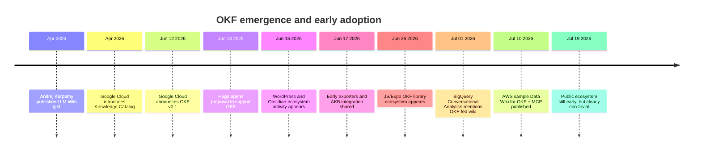
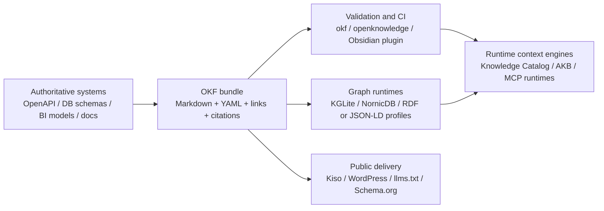

# OKF Adoption

## Executive summary

Open Knowledge Format, or **OKF**, is a real Google Cloud–authored specification announced on **12 June 2026**. It is **not** a long-standing Google-wide web standard on the level of JSON-LD or OpenAPI; it is currently a **v0.1 draft**, published in a public GitHub repository alongside sample bundles, a reference producer, and a visualiser. Google Cloud’s blog positions it as a vendor-neutral way to package organisational knowledge for agents, while the repository that hosts the draft spec and tooling explicitly states that the repository contents are **not an official Google product**. The right reading is that the **specification launch is official**, but the current codebase is still reference/sample material rather than a mature, independently governed standard. citeturn17search3turn22view0turn8view0

The specification itself is intentionally minimal. An OKF bundle is a directory tree of Markdown files with YAML frontmatter; every non-reserved Markdown file is a concept document, `type` is the only required frontmatter field, `index.md` and `log.md` are reserved filenames, standard Markdown links express relationships, and consumers are expected to be permissive about unknown types, unknown fields, broken links, and missing optional indexes. That minimalism is the source of both OKF’s appeal and its current limitations: it is easy to adopt, but much of the hard work of semantics, provenance, trust, temporal validity, and conflict resolution is deliberately deferred. citeturn15view0turn14view5

Public adoption as of **19 July 2026** is **real but early-stage**. The strongest first-party evidence is inside Google Cloud: **Knowledge Catalog** can ingest OKF and serve it to agents, and **BigQuery Conversational Analytics** now explicitly says that an existing team wiki can feed Knowledge Catalog via OKF. Outside Google, the visible market is dominated by open-source tools, WordPress/Obsidian plugins, and agent-facing runtimes rather than large, independently verified enterprise deployments. GitHub’s `google-okf` topic page showed **5 public repositories** at crawl time, the Obsidian **OKF Enforcer** plugin showed **409 downloads**, WordPress **Tick AI SEO** showed **fewer than 10 active installations**, and WordPress **RankReady** reported **200+ active installations**. Those are meaningful signals of experimentation, but not yet evidence of market-wide standardisation. citeturn6search13turn5search1turn9view0turn29view3turn29view0turn28search15

The ecosystem is already broad enough to matter. There are now credible tools for **generation** (`okfgen`, Google’s reference agent, AWS’s Glue-based Data Wiki), **validation and linting** (`okf`, `openknowledge validate`, Obsidian OKF Enforcer, AKB validator, `okf-gem` linter), **publishing** (Kiso, WordPress plugins), **runtime consumption** (Knowledge Catalog, MCP servers, Open Knowledge, OKF Harness), and **graph ingestion** (KGLite, NornicDB, Graphify bridges). In other words, OKF is quickly becoming a useful **interchange format and authoring substrate**, even where it is not the runtime system of record. citeturn25view2turn33view0turn34view4turn33view2turn33view1turn29view3turn34view0turn33view4turn34view3turn34view5turn35search1turn31search2

In the standardisation market, OKF sits in a different place from **JSON-LD**, **RDF**, **Schema.org**, **OpenAPI**, and **llms.txt**. JSON-LD and RDF address formal linked-data semantics under W3C processes; Schema.org is a collaborative public-web vocabulary; OpenAPI is a formal interface description standard for HTTP APIs; llms.txt is a lighter discovery/index proposal for websites. OKF’s niche is **portable, human-editable, agent-readable knowledge bundles**. It does not replace those standards; the most durable adoption pattern is likely to be **OKF plus existing machine contracts**, not OKF instead of them. citeturn22view0turn20search0turn20search1turn20search10turn20search15turn38search0

The most sensible next step for adopters is therefore not “standardise everything in OKF”, but rather to **pilot it as a packaging and exchange layer** around high-value knowledge domains such as data dictionaries, business metric definitions, API runbooks, operating procedures, and domain glossaries. Teams should keep formal schemas in their native standards, generate OKF where possible, validate bundles in CI, publish or ingest them through existing tools, and only then decide whether to add stronger governance conventions for provenance, lifecycle, trust, and typed relationships. citeturn22view0turn25view3turn33view1turn34view3turn24search0

## Specification and history

A note on terminology matters here. In this report, **OKF** means **Open Knowledge Format**. In adjacent open-data conversations, especially around CKAN, **OKF** has long also been shorthand for the **Open Knowledge Foundation**, which is unrelated to Google’s format. That acronym collision is one reason some search results and community references are noisy. citeturn17search3turn32search5

The conceptual precursor to OKF was Andrej Karpathy’s **LLM Wiki** pattern, published as a public gist in early April 2026. Karpathy’s core idea was that an LLM should maintain a persistent Markdown wiki, rather than repeatedly re-deriving knowledge from raw sources. Google Cloud’s OKF announcement explicitly says it is formalising that **LLM-wiki pattern** into a portable, interoperable format. citeturn16search0turn17search3

Google’s timing also matters. In April 2026, Google Cloud announced **Knowledge Catalog** as the evolution of Dataplex into an “always-on context engine” for enterprise agents. Less than two months later, Google Cloud introduced OKF and said Knowledge Catalog had already been updated to **ingest Open Knowledge Format and serve it to agents**. That sequence shows that OKF was not introduced as an abstract publishing exercise; it was launched as a packaging layer around a broader Google Cloud context-management strategy. citeturn6search3turn17search3turn6search0

Normatively, OKF v0.1 is small by design. A bundle is a directory tree of Markdown files. `index.md` is an optional directory listing, `log.md` is an optional update log, and all other Markdown files are concept documents. Every concept document must start with parseable YAML frontmatter, and only one field is required: `type`. Recommended fields include `title`, `description`, `resource`, `tags`, and `timestamp`. The body is free-form Markdown, with suggested but non-mandatory headings such as `# Schema`, `# Examples`, and `# Citations`. Consumers must tolerate unknown types, unknown keys, broken links, and missing optional indexes. The spec also says outright that it does **not** replace domain-specific schemas such as **Avro**, **Protobuf**, or **OpenAPI**. citeturn15view0turn14view5turn22view0

Two nuances are important for any rigorous reading. First, the specification is labelled **“Version 0.1 — Draft”**, and versioning guidance envisages future minor and major revisions. Secondly, while the Cloud blog and product pages are clearly official Google Cloud material, the `GoogleCloudPlatform/knowledge-catalog` repository states that “this repository and its contents are not an official Google product”. That means the **ideas are official enough to build against**, but the current toolchain should still be treated as **reference code**, not as a fully supported enterprise SDK. citeturn22view0turn14view5turn8view0

The history is therefore short but coherent: **LLM Wiki** as concept, **Knowledge Catalog** as platform context, **OKF** as open packaging layer, and then a rapid burst of ecosystem experimentation in the following five weeks. citeturn16search0turn6search3turn17search3turn24search1



The diagram above synthesises dated primary and project sources from Google Cloud, GitHub issue trackers, package registries, and official plugin pages. citeturn16search0turn6search3turn17search3turn30view0turn17search0turn23search3turn11search2turn5search1turn34view4

## Adoption across products and segments

The simplest overall judgement is that OKF has already achieved **first-party platform adoption inside Google Cloud**, **visible adoption in open-source authoring and runtime tools**, and **light but genuine uptake in CMS and note-taking ecosystems**. What it has **not** yet achieved, at least in public evidence, is broad, native adoption by the established enterprise metadata/catalogue vendors that dominate incumbent governance stacks. citeturn6search13turn5search1turn22view1turn9view0

Google Cloud is the strongest adoption case. The official announcement says **Knowledge Catalog** can ingest OKF and serve it to agents, and **BigQuery Conversational Analytics** says that with OKF “the wiki your team already maintains can feed straight into Knowledge Catalog”. That is more than lip service: it positions OKF as a practical interchange path from existing human-authored knowledge assets into a production retrieval/runtime layer. citeturn17search3turn5search1turn6search0

In open wikis and note ecosystems, OKF fits naturally because it inherits familiar Markdown-plus-frontmatter patterns. Google’s own README explicitly says OKF composes with **Obsidian**, **Notion**, **MkDocs**, **Hugo**, and **Jekyll**. By July 2026, that had already become concrete in several places: **Stashpad** added OKF export for Obsidian users; the Obsidian community plugin **OKF Enforcer** validates vault-wide conformance; and a community **Hugo** issue proposes mapping OKF’s `index.md` structure into Hugo’s `_index.md` model. This is not “native support everywhere”, but it is strong evidence that OKF can piggyback on the existing Markdown toolchain rather than demanding a new editor class. citeturn22view1turn17search0turn29view3turn30view0

CMS adoption is currently narrow but surprisingly concrete in **WordPress**. **Tick AI SEO** publishes a live OKF bundle at `/okf/`, keeps it in sync with cron, and respects noindex settings from major SEO plugins. **RankReady** says it serves a complete OKF bundle at `/okf/` alongside `llms.txt`, and **Xagio** advertises OKF bundle generation so AI engines can read site content in structured form. These are plugin-market signals, not proof that AI engines consume those bundles at scale, but they show that OKF has already crossed from developer discourse into practical content-system packaging. citeturn29view0turn29view1turn29view2

AI-platform and workflow-tool adoption is more substantial than the CMS story. **Open Knowledge**, **OKF Harness**, and **okf-skills** all treat OKF as the canonical bundle format for agent-maintained knowledge bases. **Equational Applications** added a zero-dependency `core-okf` package and advertises OKF import/export across React, Expo, and Node memory products, including a claim that the stack is production-proven in **Clanker**. **OpenKB** says its wiki pages follow the Google OKF specification, and **AKB** provides OKF export and validation while positioning OKF as the packaging layer around a fuller governance/search runtime. citeturn33view1turn34view1turn34view2turn11search4turn11search3turn10view0turn34view0

In knowledge graphs and data platforms, the picture is again one of **interop rather than replacement**. **KGLite** ingests OKF bundles into a Cypher-queryable graph. **NornicDB** documents OKF as a source and exchange format rather than a replacement for its graph/vector/MVCC runtime. A **Graphify** bridge proposal offers bi-directional conversion between graph structures and OKF. This is exactly where OKF looks strongest strategically: not as the runtime graph, but as a stable artefact that graph systems can ingest, emit, visualise, or publish. citeturn10view2turn35search1turn31search2

Data-portal adoption is almost entirely community-driven so far, but it is technically interesting. **okfgen** can generate bundles from **CKAN** and **Socrata** sources; **qsv**’s `describegpt` command can emit a data dictionary as an OKF document; and a community GOV.UK CKAN explorer demonstrates that very large catalogue corpora can be represented as bundle-like surfaces, citing **58,461 datasets** and **268,241 resources**. Again, these are not native CKAN or Socrata product features, but they show that OKF can serve as a portable view over open-data estates. citeturn33view0turn32search7turn32search10

### Current support snapshot

| Segment | Product or project | Support level | What the evidence shows | Source |
|---|---|---:|---|---|
| Google cloud platform | Knowledge Catalog | Native first-party ingest/serve | Google says Knowledge Catalog can ingest OKF and serve it to agents | citeturn17search3turn6search0 |
| Analytics AI | BigQuery Conversational Analytics | Indirect first-party consumption | Team wikis can feed Knowledge Catalog via OKF for grounded analytics | citeturn5search1 |
| Open wikis | Obsidian + OKF Enforcer | Community validation support | Vault-wide OKF validation and quick-fixes | citeturn29view3 |
| Note export | Stashpad for Obsidian | Community export support | Exports notes as OKF bundles | citeturn17search0 |
| Static site generators | Hugo | Planned/proposed | Open issue proposes native support mapping OKF structure | citeturn30view0 |
| CMS | Tick AI SEO | Live bundle export | WordPress posts/pages published at `/okf/`; cron sync | citeturn29view0 |
| CMS | RankReady | Live bundle export | Serves a complete OKF bundle at `/okf/` | citeturn29view1 |
| CMS | Xagio SEO & AEO | Live bundle export | Generates OKF bundle for AI-readable content | citeturn29view2 |
| AI workflow/runtime | Open Knowledge | Native runtime around OKF | Validation, search, MCP, publishing, deploy | citeturn33view1 |
| AI workflow/runtime | OKF Harness | Native agent-first harness | Maintains OKF-compatible LLM wikis for agents | citeturn34view1 |
| AI workflow/runtime | okf-skills | Native authoring toolkit | Claude Code plugin to author, validate, visualise OKF | citeturn34view2 |
| AI memory | Equational Applications core-okf / LLM Wiki | Import/export support | OKF primitives and OKF import/export across memory products | citeturn11search4turn11search3 |
| Knowledge graph | KGLite | Ingest support | Builds graphs from OKF bundles | citeturn10view2turn34view5 |
| Knowledge graph | NornicDB | Import/export bridge | Treats OKF as source/exchange format | citeturn35search1 |
| Data platforms | AWS Data Wiki | Official sample/reference support | Glue → OKF → MCP reference pattern | citeturn34view4 |
| Data portals | okfgen | Generator support | CKAN, Socrata, docs sites, repos, DB sources → OKF | citeturn33view0 |

### Public adoption metrics and evidence quality

| Metric | Value at crawl time | What it means | Caveat | Source |
|---|---:|---|---|---|
| `google-okf` GitHub topic repos | 5 public repositories | Small but genuine topic-specific GitHub footprint | Under-counts projects that do not use the topic tag | citeturn9view0 |
| Knowledge Catalog repo stars | 7.4k | High attention to the broader repository | Repo covers more than OKF alone | citeturn8view0 |
| OKF Enforcer downloads | 409 | Measurable Obsidian adoption | Plugin metric, not bundle metric | citeturn29view3 |
| Tick AI SEO active installs | Fewer than 10 | Very early CMS adoption | Tiny installed base | citeturn29view0 |
| RankReady active installs | 200+ | More meaningful WordPress visibility | Plugin install count is not OKF endpoint traffic | citeturn28search15 |
| Kiso stars | 15 | Early open-source publishing interest | GitHub stars are weak demand proxies | citeturn34view3 |
| Equational repo stars | 21 | Early developer uptake for OKF primitives | Repo includes broader memory stack | citeturn11search4 |

The market signal from those numbers is straightforward: public adoption is **not negligible**, but it is still **pre-mainstream and mostly community-led**. There is not yet a reliable public dataset for bundle counts, enterprise seats, or cross-industry usage by region. citeturn9view0turn29view3turn29view0turn28search15

## Tooling, compliance, and delivery chains

Google’s own repository already models the bare minimum OKF toolchain. It includes a **reference producer** that can enrich bundles from BigQuery metadata plus a web-crawling pass, three sample bundles, and a **visualise** subcommand that renders a self-contained interactive HTML graph from any OKF bundle. Those samples matter because they show how Google thinks OKF should be used in practice: not as a single flat folder, but as a progressively disclosed linked corpus with citations and graph navigation. citeturn25view2turn22view1

Outside Google, the most mature compliance-oriented toolchains are now centred on deterministic validation. **Open Knowledge** explicitly exposes `validate`, `search`, `list`, `view`, MCP integration, HTML export, registry aliases, and deployment. **okfcli/okf** is a Go toolkit that creates, validates, lints, indexes, searches, and inspects bundles. **okq** focuses on local search/navigation over frontmatter and link graphs. **okf-gem** bundles validation, linting, search, and graph exploration in a local Ruby toolchain. **OKF Harness** wraps agent workflows around OKF-compatible workspaces, and **AKB** includes OKF export plus `okf-validate`. citeturn33view1turn33view2turn33view3turn33view4turn34view1turn34view0

Publishing is emerging as a distinct layer. **Kiso** turns bundles into static websites for humans and AI agents, including `llms.txt` and `sitemap.xml`, and explicitly supports GitHub Actions for CI/CD publishing. That is strategically important because it gives teams a bridge from a private or version-controlled OKF bundle to a public documentation or partner-facing surface without throwing away the OKF structure. WordPress plugins are solving a similar problem for content-managed websites by emitting `/okf/` endpoints directly from the CMS. citeturn34view3turn29view0turn29view1

The generator layer is becoming crowded very quickly. **okfgen** is notable because it treats OKF as a common output for repos, local directories, schema files, BigQuery, Firestore, docs sites, CKAN, and Socrata, and it also includes validate, search, ask, and visualise paths. **AWS Data Wiki** is narrower but more vendor-specific: it converts **AWS Glue** catalogue knowledge into OKF bundles and serves them through **MCP**. **OpenKB** converts raw documents into a wiki that it says is “OKF-ready”. **qsv** can emit a data dictionary as an OKF document. These are all distinct producer patterns, which is exactly what the Google spec set out to encourage. citeturn33view0turn34view4turn10view0turn32search7

### Toolchain comparison

| Tool | Main role | Compliance features | Delivery pattern | Source |
|---|---|---|---|---|
| Google reference agent | Producer + visualiser | Spec-shaped output; sample bundles; visualiser | BigQuery/web → bundle → `viz.html` | citeturn25view2 |
| Open Knowledge | Full runtime | Deterministic validation, MCP, HTML, graph, registry | Local or deployed runtime around OKF | citeturn33view1 |
| okf | CLI validator/linter | Create, validate, lint, index, search, inspect | Static Go binary | citeturn33view2 |
| okq | Local search/navigation | Frontmatter and link-graph search; stable JSON shapes | CLI for humans and agents | citeturn33view3 |
| OKF Harness | Agent-first authoring | Workspace checks, evidence/read/graph tooling | Local agent-maintained OKF wiki | citeturn34view1 |
| okf-skills | Agent plugin | Author, maintain, validate, visualise | Claude Code plugin / skills package | citeturn34view2 |
| okf-gem | All-in-one local harness | Validate, lint, search, embed, graph | Ruby gem, 100% local | citeturn33view4 |
| Kiso | Publisher | Structured build, agent-facing outputs, GitHub Action | OKF → static site + `llms.txt` | citeturn34view3 |
| okfgen | Multi-source generator | Built-in validate, search, ask, visualise | Repo/DB/docs/data portal → OKF | citeturn33view0 |
| AKB | Runtime + bridge | `okf-export`, `okf-validate` | Managed vault/runtime around OKF | citeturn34view0 |
| KGLite | Graph ingestion | Converts frontmatter and links into graph structure | OKF → Cypher-queryable graph | citeturn10view2turn34view5 |
| Obsidian OKF Enforcer | Editor-side validation | Enforces spec §9, quick-fixes, on-save checks | Conformance inside Obsidian vaults | citeturn29view3 |

A practical point follows from that table: **OKF compliance is already automatable**, even though the official spec remains draft. That is an important adoption accelerant. The spec’s conformance rules are intentionally few, which makes it comparatively cheap to lint, validate, and enforce in CI or editor workflows. citeturn14view5turn29view3turn33view2

## Standardisation, interoperability, and mapping

OKF is best understood as a **packaging standard for knowledge artefacts**, not a semantic-web ontology, an API contract, or a discovery protocol. In current governance terms, it is also comparatively immature: there is no independent standards body stewarding the OKF draft today. The specification lives in a Google-affiliated GitHub repository with active issues and discussions, while formal standards ecosystems such as W3C and the OpenAPI Initiative govern competing or complementary artefact classes under longer-established processes. citeturn17search3turn23search13turn20search15turn20search0turn20search1

That matters because OKF’s “market” is not winner-take-all. It overlaps with at least five adjacent families:

| Standard or format | Governance / status | What it standardises | Relationship to OKF | Source |
|---|---|---|---|---|
| OKF | Google Cloud-authored draft, open repo | Portable Markdown knowledge bundles | Focuses on authorable knowledge packaging | citeturn22view0turn17search3 |
| JSON-LD 1.1 | W3C Recommendation | Linked Data in JSON | Better for formal graph semantics and web data exchange | citeturn20search0turn20search12 |
| RDF 1.2 | W3C Recommendation-track / Candidate Recommendation Snapshot | Graph data model and serialisations | Better for typed triples, reasoning, knowledge-graph interoperability | citeturn20search1turn20search5 |
| Schema.org | Collaborative community activity linked to W3C CG | Public-web structured data vocabulary | Better for search/web discoverability; weaker for long-form operational knowledge | citeturn20search10turn20search2 |
| OpenAPI | OpenAPI Initiative specification | HTTP API interface descriptions | Better for executable API contracts; explicitly named by OKF as out of scope to replace | citeturn20search15turn20search7turn22view0 |
| llms.txt | Community proposal | Site-level discovery/index for LLMs | Good discovery complement; much thinner content model than OKF | citeturn38search0turn38search4 |

The most robust interoperability strategy is therefore **layering**. Keep **OpenAPI**, Avro, Protobuf, dbt, or native catalogue metadata as the authoritative machine contract; use **OKF** to add the missing human-and-agent context around those assets; and use **Schema.org** or **llms.txt** where public-web discovery is also needed. Google’s own spec supports this reading, because it explicitly says it does not replace domain-specific schemas and allows arbitrary extra fields and citations. Kiso’s build pipeline reinforces the complementary pattern by generating `llms.txt` from an OKF source. citeturn22view0turn34view3

The mapping path to **RDF/JSON-LD** is already starting to appear, but as a community extension rather than core OKF. A proposal in Google’s issue tracker suggests a semantic-web profile with **IRI-based identity**, **typed fenced RDF blocks**, **Graph Store Protocol deployment**, and optional **SHACL** validation, using work from the newly launched **W3C Holon Community Group** as a reference implementation. That is significant not because it is standard today, but because it shows where serious graph practitioners see OKF heading: OKF as a human-readable carrier with optional semantic-web profiles layered on top. citeturn7search4turn37search0turn37search1

The same logic applies to runtime graphs. **Knowledge Catalog** uses its own native metadata model, including **aspect types** defined as JSON templates, and then enriches those into a dynamic context graph. **NornicDB** and **KGLite** similarly treat OKF as an exchange surface and build richer queryable representations internally. This suggests a likely durable market structure: OKF wins as a **lowest-common-denominator exchange and authoring format**, while richer runtimes continue to use more structured internal models. citeturn6search11turn6search2turn35search1turn10view2



The practical takeaway from this architecture is that OKF maps best to the **knowledge-at-rest** layer. Everything else—API execution, graph reasoning, provenance enforcement, public discovery, trust chains—can be layered above or beside it. citeturn22view0turn6search12turn35search1turn34view3

## Practical workflows for creators and integrators

A creator workflow that is actually sustainable with OKF tends to follow a “**generate, curate, validate, publish, ingest**” pattern. That pattern is visible in Google’s reference agent, which first writes one OKF document per concept from source metadata and then optionally performs a second web pass to enrich those concepts with authoritative documentation. The same broad shape appears in OKF Harness, Open Knowledge, okfgen, and AWS Data Wiki. citeturn25view2turn34view1turn33view1turn33view0turn34view4

A minimal concept template is simple enough to keep human editing cheap:

```yaml
---
type: Metric
title: Net revenue
description: Business definition and calculation notes for net revenue.
resource: urn:metric:net_revenue
tags: [finance, semantics]
timestamp: 2026-07-19T09:00:00Z
---
# Definition

Explain the meaning, assumptions, exclusions, and links to related concepts.

# Citations

List the system of record, dashboard, policy, or external reference.
```

That template is consistent with the v0.1 frontmatter rules and recommended body conventions in the draft spec. citeturn15view0

For **CI/CD**, the most useful discipline is to keep compliance and drift separate. Conformance validation checks whether the bundle obeys OKF shape rules; drift checks whether the bundle still reflects the current source system. A productive community discussion around `erd2okf` makes exactly that distinction, recommending that regeneration be cheap and that CI fail only when there is **structurally relevant drift** between the source database and the committed bundle. Kiso then picks up the next stage by building static sites from validated bundles in GitHub Actions, while Open Knowledge and OKF Harness support agent-driven maintenance in local or deployed runtimes. citeturn12search1turn34view3turn33view1turn34view1

For **governance**, teams should be realistic about what the base spec does not guarantee. The community is already layering conventions for provenance, summarisation faithfulness, validity windows, typed relationships, and integrity/trust onto OKF’s permissive extension points. The most useful near-term governance pattern is to keep the base bundle valid OKF, add optional organisation-specific keys for lifecycle and provenance, and use bundle validation plus pull-request review as the hard gate. That keeps interoperability with simple consumers while allowing stronger local policy. citeturn21search0turn21search2turn23search3turn24search0

For **delivery**, there are now three clear modes. The first is **internal ingestion** into a context engine such as Knowledge Catalog. The second is **agent-side filesystem or MCP use**, using tools like Open Knowledge, AKB, KGLite, or AWS Data Wiki. The third is **public/static publication**, via Kiso or WordPress `/okf/` endpoints, optionally paired with `llms.txt` and web structured data. Which mode is right depends less on OKF itself than on the team’s target consumers. citeturn6search13turn33view1turn34view0turn34view5turn34view4turn34view3turn29view0turn29view1

## Critiques, limitations, case studies, and recommendations

The most consistent critique of OKF is that it delivers **structural interoperability** faster than it delivers **semantic interoperability**. The spec guarantees that a bundle will be readable and navigable in broadly the same way across tools. It does **not** guarantee shared type systems, typed or weighted edges, provenance, confidence, temporal validity, contradiction handling, or bundle federation. Google’s own issue tracker is full of proposals on exactly those topics: typed relationships, stable identities, rationale trails, external references, citation conventions, provenance kernels, and semantic-web profiles. citeturn22view0turn23search3turn23search4turn23search5turn23search9turn21search2turn7search4

A second limitation is that OKF is intentionally sparse in its body model. There are no required body sections beyond Markdown itself, only conventions. That keeps authoring friction low, but it also means two conformant bundles can differ radically in quality, granularity, and machine usefulness. This is why so many community tools immediately add linting, templates, quick-fixes, or richer profiles on top of base conformance. citeturn15view0turn29view3turn33view4

A third critique is about **trust and time**. In a thoughtful production discussion comparing OKF with the Knowledge Context Protocol, practitioners argued that `timestamp` answers “when the file changed”, not “when the knowledge is valid”; that trust is manageable inside a single repository but harder across organisational boundaries; and that agents need more explicit resolution of supersession and contradiction than plain Markdown links provide. Even the OKF-side response in that discussion broadly accepted those concerns while arguing they might belong in a governance layer above the base format. citeturn24search0

Academic work is beginning to frame the same point. A July 2026 vision paper on **knowledge-centric information systems** treats LLM Wiki and OKF as early evidence of a broader “knowledge architecture” transition, but explicitly says they are **not the endpoint**. Another July 2026 benchmarking paper found that an OKF-based memory setup improved retrieval precision over several memory tools in its test harness, yet still “did not solve selection or session drift”; because that benchmark reflects one implementation rather than the spec itself, it should be read as indicative rather than definitive. citeturn21search1turn21search3turn21search4

There is also a conceptual debate about **public-web use**. Several WordPress and SEO-oriented tools are framing OKF as an “AI visibility” mechanism, but their own documentation often has to clarify that **OKF is not a Google Search ranking signal**. That distinction is important. Google introduced OKF through Google Cloud’s data/AI context stack, not through Search documentation. Public-web packaging may become a real use case, but it is not what the first-party launch primarily standardised. citeturn29view0turn17search3

### Notable deployments and case studies

| Case | What is actually evidenced | Interpretation | Source |
|---|---|---|---|
| Knowledge Catalog ingest | Google says Knowledge Catalog ingests OKF and serves it to agents | Strongest first-party adoption evidence | citeturn17search3turn6search0 |
| BigQuery Conversational Analytics | Team wiki can feed Knowledge Catalog via OKF | Official downstream usage path inside Google Cloud analytics | citeturn5search1 |
| Google sample bundles | GA4, Stack Overflow, Bitcoin bundles with visualisers | Reference examples, not customer deployments | citeturn22view1turn25view2 |
| AWS Data Wiki | Glue → OKF → MCP sample | Official AWS sample, still a reference architecture | citeturn34view4 |
| GOV.UK CKAN explorer | Community OKF surface over 58,461 datasets and 268,241 resources | Evidence of large-corpus feasibility, not native CKAN support | citeturn32search10 |
| Clanker memory stack | Vendor claims OKF import/export is production-proven in Clanker | Useful vendor signal, but self-reported | citeturn11search3 |
| Nutritionist iOS app | Served by wiki-as-an-mcp as a plain-Markdown OKF knowledge base | Small but concrete application deployment | citeturn28search10 |

The evidence base has obvious gaps. There are **no public analyst-grade adoption counts**, **no independently audited bundle registries**, **few regional adoption signals outside the GitHub/WordPress/open-source orbit**, and **very little primary-source evidence of native support from incumbent enterprise data-catalogue vendors beyond Google Cloud**. That uncertainty should be treated as real, not brushed aside. citeturn9view0turn17search3turn23search13

The most defensible recommendations for an organisation evaluating OKF are these:

1. **Use OKF as a packaging layer first, not as your only knowledge model.** Keep authoritative API, data, and governance models in their native standards, and wrap them with OKF where human-readable context is missing. citeturn22view0turn20search7  
2. **Start with a bounded pilot** such as business metric definitions, data dictionaries, API runbooks, or operational playbooks—domains where Markdown plus citations is immediately useful and token-efficient. citeturn17search3turn15view0  
3. **Automate generation and validation early.** Use generators where possible, validate in CI, and separate conformance from drift checks so that bundle freshness is enforceable rather than aspirational. citeturn33view0turn33view2turn12search1  
4. **Decide deliberately whether your target is internal runtime ingestion, public publication, or agent-side local use.** The right stack differs for Knowledge Catalog, MCP runtimes, or static web publication. citeturn6search13turn33view1turn34view3turn29view0  
5. **Plan for extensions around provenance, validity, trust, and typed relationships.** The base spec is deliberately permissive, and serious production use will almost certainly need at least some local conventions in those areas. citeturn21search0turn21search2turn23search3turn24search0  

On balance, OKF looks less like a finished universal standard and more like a **useful, timely convergence layer**. That is still significant. Many standards succeed not by replacing everything around them, but by becoming the simplest reliable boundary between heterogeneous systems. In mid-2026, that is the strongest evidence-backed way to understand OKF. citeturn17search3turn21search1turn22view0